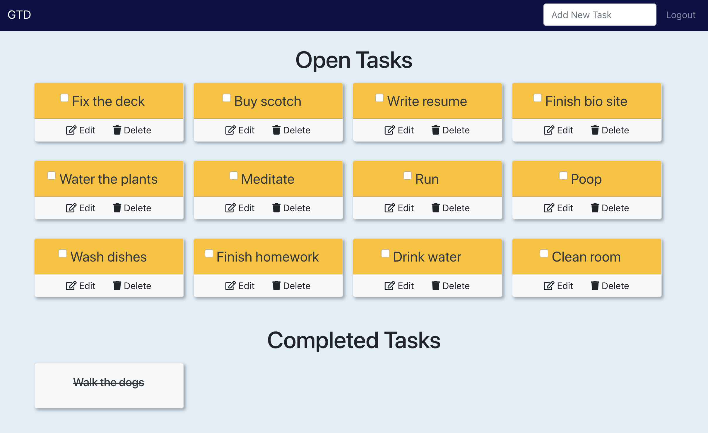
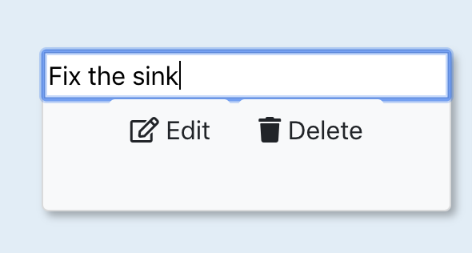
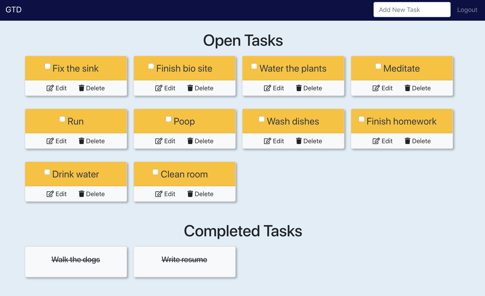

# Get Things Done: A To-Do app

## Description
This is a basic to-do app. On load, the user can log in with Google authentication, and then create, edit, and delete tasks. Once a task is complete, the user can click the checkbox next to the task name, the task will then be moved to the Completed Tasks area further down the page. This app makes full use of CRUD axios methods with Firebase.
The current website can be viewed [here](https://to-do-3110d.firebaseapp.com/).

## Technologies Used
* Webpack
* Axios
* Firebase
* ES6 Modules
* SASS
* Bootstrap

## How to run this app
Note: To run this app you will need a firebase account and a new project.

### 1. Configure Firebase
1. Clone the repository to a local machine.
2. Run the following command in terminal to download the web dependencies: `npm install`
3. In the db folder, rename apiKeys.json.example to apiKeys.json.
4. In Firebase, create a new project.
5. Navigate to your config object, and copy the keys from Firebase into the apiKeys.json file.
6. Create a realtime databse in Firebase, and start in test mode.
7. Import the `./db/tasks.json` file into the database to seed data.

### 2. Serve up the app
* Run `npm start` in your terminal to initiate the app.
